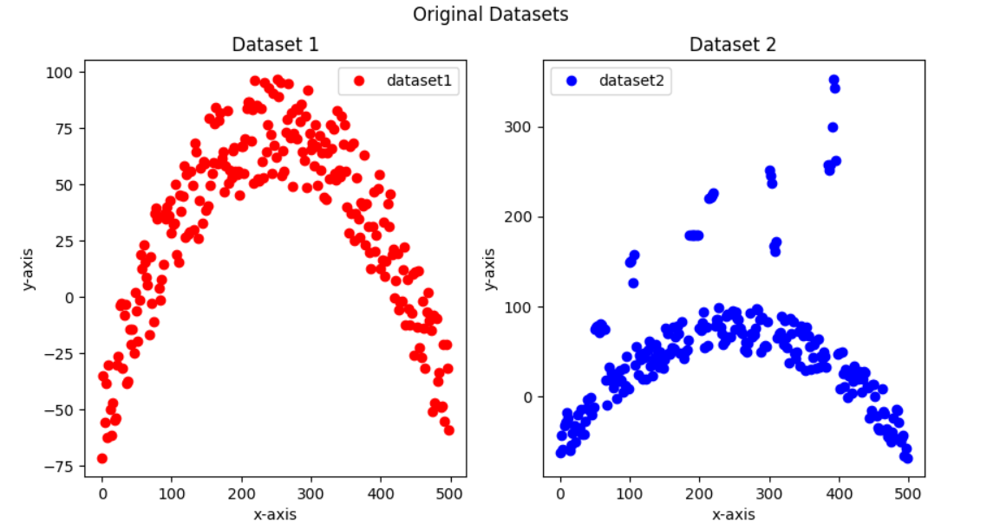
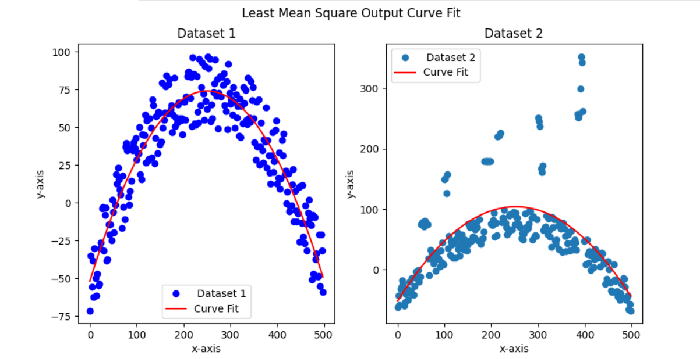
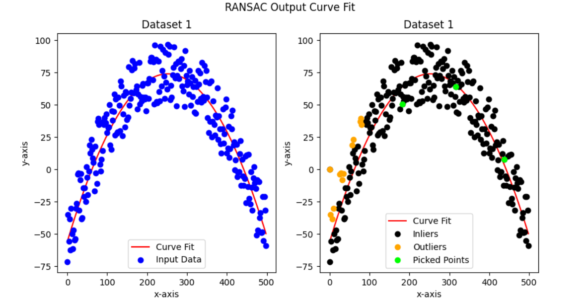
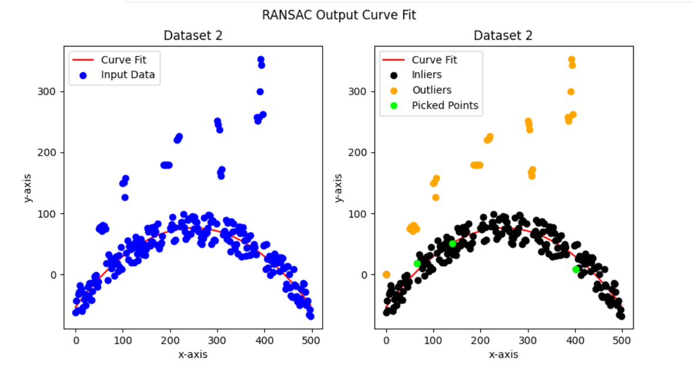

## Curve Fitting Using RANSAC and LMSE
The aim of this project is to compare the curve fitting 
abilities(Outlier Rejection Capability) of two algorithms 
LMSE (Least Mean Squared Error) and RANSAC (Random Sample 
Consensus) on two datasets:
- Dataset 1 - No Outliers 
- Dataset 2 - With Outliers

---
## Instructions

### Dependencies
- python3
- numpy==1.18.0
- matplotlib
- pandas

### Run using Command Line
```
git clone https://github.com/kartikv97/Curve_Fitting_RANSAC.git
cd Curve_Fitting_RANSAC/src
python demo.py 
```
---
## Results

### Input Dataset


### LMSE Curve Fit


### RANSAC Curve Fit



